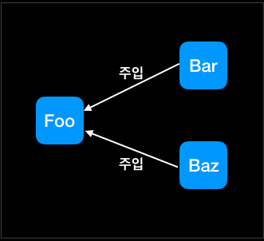

```
주요 내용정리
```
### 자바 개발 간소화를 지원하기 위해 스프링은 네 가지 주요 전략을 사용한다.
* POJO를 이용한 가볍고(lightweight) 비침투적(non-invasive)인 개발
* DI와 인터페이스 지향(interface orientation)을 통한 느슨한 결합도(loose coupling)
* 애스펙트와 공통 규약을 통한 선언적(declarative) 프로그래밍
* 애스펙트와 템플릿(template)을 통한 반복적인 코드 제거

> 비침투적 개발이란, 바탕이 되는 기술을 사용하는 클래스, 인터페이스, API 등을 코드에 직접 나타내지 않는 방법이다. 복잡함을 분리할 수 있다.

### 종속객체 주입(DI, Dependency Injection)
* 종속객체 주입은 객체가 스스로 종속객체를 획득하는 것과는 반대로 객체에 종속객체가 부여되는 것을 의미한다.


* 애플리케이션 컴포넌트 간의 관계를 정하는 것을 **와이어링(wiring)**이라고 한다.

### 애스펙트 적용
* DI가 소프트웨어 컴포넌트의 결합도를 낮춰 준다면, 애스펙트 지향 프로그래밍은 애플리케이션 전체에 걸쳐 사용되는 기능을 재사용할 수 있는 컴포넌트에 담는다.
* 애스펙트 지향 프로그래밍은 소프트웨어 시스템 내부의 관심사들을 서로 분리(separation of concerns)하는 기술이라고 설명한다.

### 스프링 컨테이너
1. 빈 팩토리(org.springframework.beans.factory.BeanFactory)
- DI에 대한 기본적인 지원을 제공하는 가장 단순한 컨테이너
2. 애플리케이션 컨텍스트(org.springframework.context.ApplicationContext)
- 빈 팩토리를 확장해 프로퍼티(property) 파일에 텍스트 메시지를 읽고 해당 이벤트 리스너(listener)에 대한 애플리케이션 이벤트 발행 같은 애플리케이션 프레임워크 서비스를 제공하는 컨테이너

